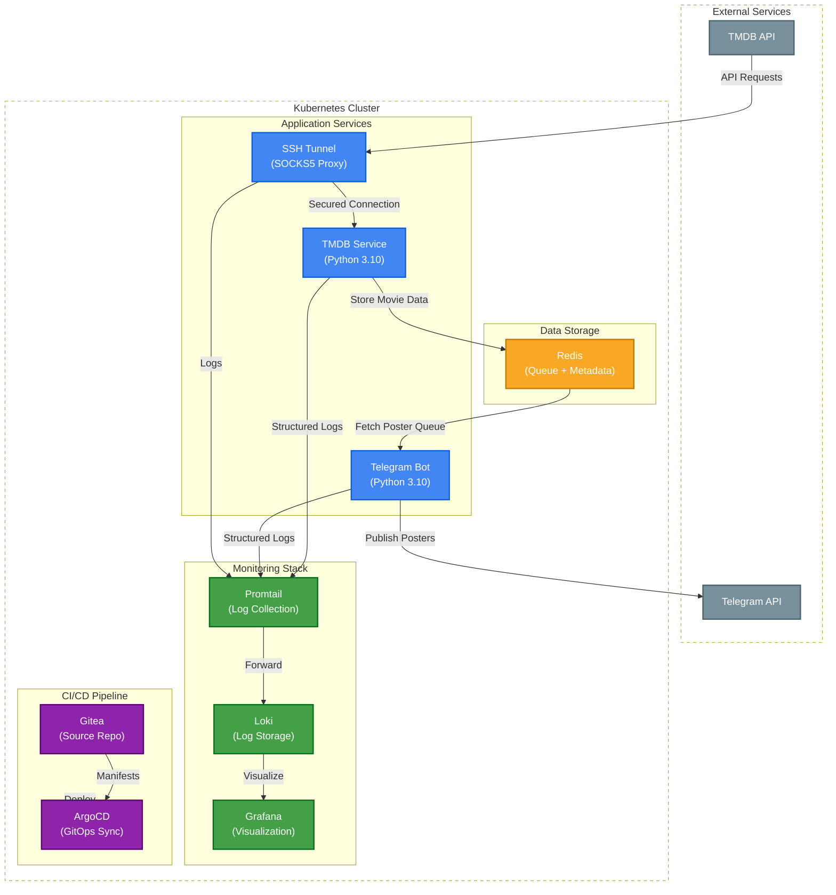

# My Favorite Movie Poster Telegram Bot (Kubernetes Deployment)


A sophisticated microservices architecture that automatically fetches movie posters from TMDB API and publishes them to Telegram, built with Kubernetes, Redis, and Python.

## 🚀 Key Features

- **Automated Pipeline**: Fetches movie data from TMDB API every 40 seconds
- **Telegram Integration**: Publishes posters with ratings to configured Telegram channel
- **Kubernetes Deployment**: Full CI/CD pipeline with ArgoCD for GitOps
- **Observability**: Integrated with Loki, Promtail and Grafana for logging
- **Resilient Architecture**: Health checks, retries, and proper error handling

## 🛠️ Technical Stack

| Component       | Technology |
|-----------------|------------|
| Orchestration   | Kubernetes |
| CI/CD           | ArgoCD, GitOps |
| Cache           | Redis |
| Monitoring      | Loki, Promtail, Grafana |
| Language        | Python 3.10 |
| Networking      | SOCKS5 Tunnels |

## 📦 System Architecture



## 🔧 Installation

### Prerequisites
- Kubernetes cluster
- Redis
- Telegram Bot Token
- TMDB API credentials

```bash
# Clone the repository
git clone https://your-repository-url.git
cd my_tg_chan

# Deploy to Kubernetes
kubectl apply -f k8s/k8s-manifests.yaml
```

## 📊 Metrics & Monitoring

The system includes comprehensive logging with:
- Structured JSON logs
- Trace IDs for request correlation
- Host/pod/namespace metadata
- Integration with Grafana/Loki

## 🤝 Contributing

Contributions are welcome! Please open an issue or submit a PR.

## 📄 License

This project is licensed under the MIT License.

## 🏆 Project Highlights

- Implemented full CI/CD pipeline with automated image tagging
- Designed resilient microservices architecture
- Developed comprehensive logging and monitoring
- Containerized all components with security best practices
- Automated deployment with ArgoCD GitOps
